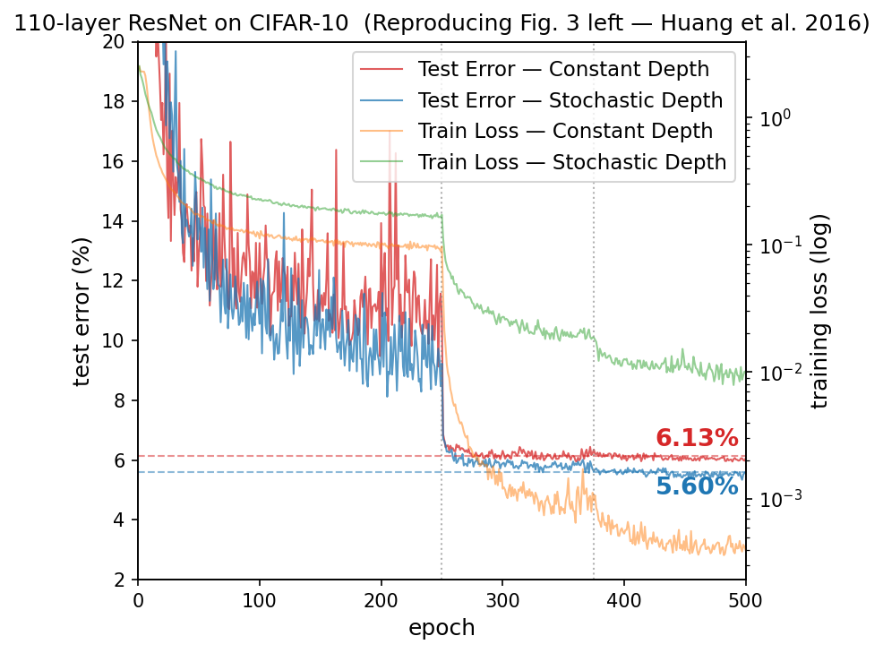

# Deep Networks with Stochastic Depth (Replication Study)

**CS 5782 Final Project** | Jin Fan (jf936) · Yixuan Yang (yy2445) · Youlun Jiang (yj622)

---

## Introduction

This repository contains our re-implementation of **Deep Networks with Stochastic Depth** by [Huang et al., "Deep Networks with Stochastic Depth" (arXiv:1603.09382, 2016)](https://arxiv.org/abs/1603.09382). The paper proposes randomly dropping entire residual blocks during training while using the full-depth ResNet at test time, improving both training efficiency and generalization. Our project reproduces the main CIFAR-10 result using a 110-layer ResNet and further analyzes why stochastic depth works through gradient behavior, feature representations, and label-noise robustness.

---

## Chosen Result

We reproduce the paper’s central CIFAR-10 result: stochastic depth improves the test error of ResNet-110 compared with a constant-depth baseline while reducing wall-clock training time. The original paper reports approximately **5.25% test error** for stochastic depth compared with **6.41%** for constant depth, along with around **25% training-time speedup**. This result was chosen because it directly supports the paper’s main claim that stochastic depth acts as both a regularizer and a training accelerator.

---

## GitHub Contents

```
├── code/         # Re-implementation code and training scripts
├── data/         # Dataset instructions or CIFAR-10 download notes
├── results/      # Generated figures, tables, logs, and analysis outputs
├── poster/       # Final poster PDF
├── report/       # Final 2-page report PDF
├── README.md     # Project overview and reproduction instructions
├── LICENSE       # Project license
└── .gitignore    # Ignored files and folders
```

---

## Re-implementation Details

- **Model:** 110-layer ResNet (3 × 18 blocks, filters: 16 / 32 / 64)
- **Dataset:** CIFAR-10 (45k train / 5k val / 10k test)
- **Training:** SGD, momentum 0.9, weight decay 1e-4, lr=0.1 decayed 10× at epochs 250 and 375, 500 epochs total
- **Survival probabilities:** linear decay, pL = 0.5
- **Device:** A100 GPU
- **Key modification:** Original code in Torch 7; we re-implemented fully in PyTorch

---

## Reproduction Steps

#### 1. Clone the repo
```bash
git clone https://github.com/catttjyl/cs5782_finalproject_SD
cd cs5782_finalproject_SD
```
#### 2. Run the Jupiter notebooks!
Open `code/Stochastic_depth_reproduction_with_experiments_final.ipynb`. All required dependencies are installed automatically in the first few cells of the notebook, so no manual setup is needed.
You can run the notebook locally if your machine has a CUDA-compatible GPU. Alternatively, if you have access to Colab Pro, we recommend running it with Google Colab, as the full training pipeline is resource-intensive and benefits from higher-tier GPU allocation.

**Compute requirement:** A single A100 GPU; ~2.5 hours per run.

---

## Results / Insights

| Method | Test Error | Training Time |
|---|---|---|
| Constant Depth | 6.13% | 2h 51m |
| Stochastic Depth | 5.60% | 2h 28m (−13.2%) |

<p>
  
</p>

Our reproduction supports the paper’s central claim: stochastic depth improves test performance and reduces training time compared with constant depth. Beyond accuracy, stochastic depth maintains stronger gradient flow in early layers, learns more generalizable feature representations (higher k-NN accuracy despite looser clusters), and is significantly more robust to label noise.

---

## Conclusion

Our re-implementation confirms that stochastic depth is a simple and effective method for training very deep residual networks. It improves generalization, reduces training time, alleviates vanishing gradients, and increases robustness under label noise.

Future work could include running multiple random seeds, evaluating CIFAR-100 and SVHN, testing different survival probability schedules, and reproducing the deeper 1202-layer ResNet experiment.

---

## References

[1] G. Huang, Y. Sun, Z. Liu, D. Sedra, and K. Q. Weinberger, “Deep networks with stochastic depth,” arXiv:1603.09382, 2016.

---

## Acknowledgements

This project was completed as part of **CS 5782: Intro to Deep Learning** at Cornell University, Spring 2026.
